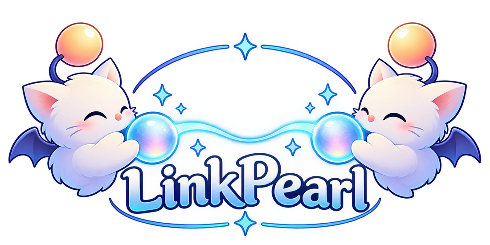
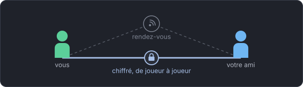
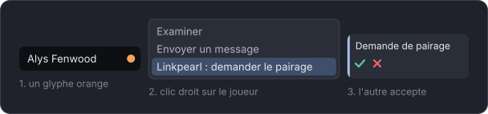
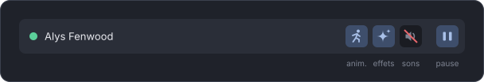

<p align="center">
  
</p>

<p align="center">
  <b>See your friends' modded looks in Final Fantasy XIV,<br>
  straight from player to player, with no server in between.</b>
</p>

<p align="center">
  <a href="https://linkpearl-sync.github.io/">linkpearl-sync.github.io</a> · <a href="https://github.com/orgs/LinkPearl-Sync/projects/3">Roadmap</a>
</p>

<p align="center">
  <b>English</b> · <a href="README.fr.md">Français</a>
</p>

> [!NOTE]
> The plugin's interface is in French for now. Below, each in-game label is quoted exactly as it appears, followed by its meaning.

---

## Install

In game, type `/xlsettings`, open the **Experimental** tab, and paste this address into **Custom Plugin Repositories**:

```
https://linkpearl-sync.github.io/repo.json
```

Click **+**, then **Save**. Then open `/xlplugins`, search for **Linkpearl Sync** and install it.

> [!IMPORTANT]
> Version 0.3.0 no longer connects to 0.2.x: you and your friends need to update together.

**Requirements:** [Penumbra](https://github.com/xivdev/Penumbra) and [Glamourer](https://github.com/Ottermandias/Glamourer), installed and enabled.

---

## What Linkpearl does

You pair with a friend, in game, in two clicks. From then on, each of you sees the other as they dressed up: Penumbra mods, Glamourer state, and what neighbouring plugins show.

<p align="center">
  
</p>

- **Player to player.** Your files go straight from your game to your friend's, end-to-end encrypted. No server stores or redistributes them. When a direct connection is impossible, they pass through the rendezvous service's relay, which carries them without being able to read them.
- **Only with the people you chose.** Nothing is shared unless you both agree.
- **More than outfits.** Modded animations, visual effects and sounds, plus what Customize+, SimpleHeels, Honorific, Moodles and PetNicknames show.

---

## Getting started

### First launch

A short introduction opens and asks you to choose **where to keep the cache** (the looks you receive, kept on your disk so they don't have to be downloaded again) and **its maximum size**. You can change both at any time in the settings.

The plugin window opens with `/lpearl`, or by clicking the Linkpearl entry in the game's server info bar.

### Pairing

<p align="center">
  
</p>

1. Get close to your friend. An **orange glyph** next to their name means they use Linkpearl.
2. **Right-click** their character, then **Linkpearl : demander le pairage** (request pairing). You can also use the **Autour** (nearby) page of the window.
3. Your friend gets a notification and **accepts** with one click.

That's it: your looks are exchanged whenever you are within range of each other.

### Glyph colours

| Colour | Meaning |
|---|---|
| Green | paired and connected |
| Orange | uses Linkpearl, not paired yet |
| Blue | sent you a pairing request |
| Grey | paired, offline or paused |
| Red | paired, but something failed: see the **Pairs** page |

---

## Day to day

<p align="center">
  
</p>

- **Reapply** a look that didn't apply properly: right-click the character, **Linkpearl : réappliquer** (reapply).
- **Direct or relayed**: on the **Pairs** page, an icon next to each connected peer's name shows whether the session is direct or goes through the relay, with the latency in its tooltip.
- **Pause a peer**: **Pairs** page, pause button. The connection closes and their look is removed.
- **Block animations, effects or sounds**: for everyone from the window's title bar, or for a single peer from the **Pairs** page. Nothing you block is downloaded.
- **The cache**: folder and size in **Réglages > Cache** (Settings > Cache). Past the size you chose, the oldest looks go first, never the ones currently in front of you.
- **Back up your identity**: **Réglages > Identité** (Settings > Identity). A single file, password-protected if you like. After a reinstall or on another PC, restoring it saves you from pairing with everyone again.

---

## Groups

A group syncs all its members with each other, without pairing them one by one: a free company, a roleplay circle. Everything happens on the **Groupes** (Groups) page of the window.

- **Create**: **Créer un groupe** (create a group), give it a name, optionally a password, then **Créer** (create). With a password, any member online lets in whoever knows it. Without one, you or a moderator approve each newcomer.
- **Share the code**: under the group name, the code (`ABCD-EFGH-JKLM@service`) and its **Copier le code** (copy the code) button. Send it by /tell. The page shows it to the owner and the moderators only.
- **Join**: **Rejoindre** (join), paste the code, the password if the group has one, then **Rejoindre**. A member must be online to answer, or a moderator if the group approves each newcomer. Joining needs **Me signaler aux autres joueurs** (let other players see me) turned on: that is how the group answers you.
- **Approve**: requests to join show up on the **Demandes** (Requests) page for the owner and the moderators, with **Accepter** (accept) and **Refuser** (decline).
- **Moderate**: on a member's row, **Exclure** (exclude) takes two clicks, and the owner can **Nommer modérateur** (make moderator). Under **Gestion** (management): **Nouveau code** (new code), **Changer le mot de passe** (change password), the **Exclus** (excluded) list with **Lever** (lift), and for the owner the **Mode d'admission** (admission mode): **Mot de passe** (password) or **Validation par un modérateur** (approval by a moderator).
- **Leave or dissolve**: **Quitter le groupe** (leave the group). The owner doesn't leave: they dissolve the group with **Dissoudre** (dissolve), under **Gestion**. Members find out when they next meet the owner, so keep the group in your list until they have, then **Retirer de la liste** (remove from the list).

The code is a door, not a key: on its own, it lets no one in. After excluding someone who knew the password, change the code and the password.

---

## Privacy

- Your files leave your game only for the peers you accepted, end-to-end encrypted.
- For two players to find each other, Linkpearl goes through a **rendezvous service**. It never sees your files or your looks. It does see pairing requests go by, with the characters' names and public keys, and the IP addresses of those who use it.
- If you keep **Me signaler aux autres joueurs** (let other players see me, on by default), the service can know that your character is online: that is what lets others recognise you. You can turn it off in **Réglages > Visibilité** (Settings > Visibility).
- Joining a group also goes through the rendezvous service, which sees the code and the character's name and world. As with pairing, trust is established on first contact: for a group with a password, a long password is what really protects it.
- You can host your own rendezvous service: see the [self-hosting guide](https://linkpearl-sync.github.io/expert.html#self-host). You and your friends just need to share at least one.

---

## Questions or problems?

Open an [issue](https://github.com/LinkPearl-Sync/linkpearl-sync-plugin/issues) describing what you did and what you saw. The Dalamud log (`/xllog`) helps a lot. Issues in English or French are both welcome.

For the curious, [the technical page](https://linkpearl-sync.github.io/expert.html) explains connections, encryption and federation. For contributors, the design and the protocol are described in [`docs/`](docs/) (in French).
